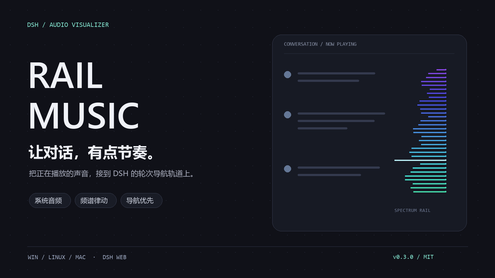
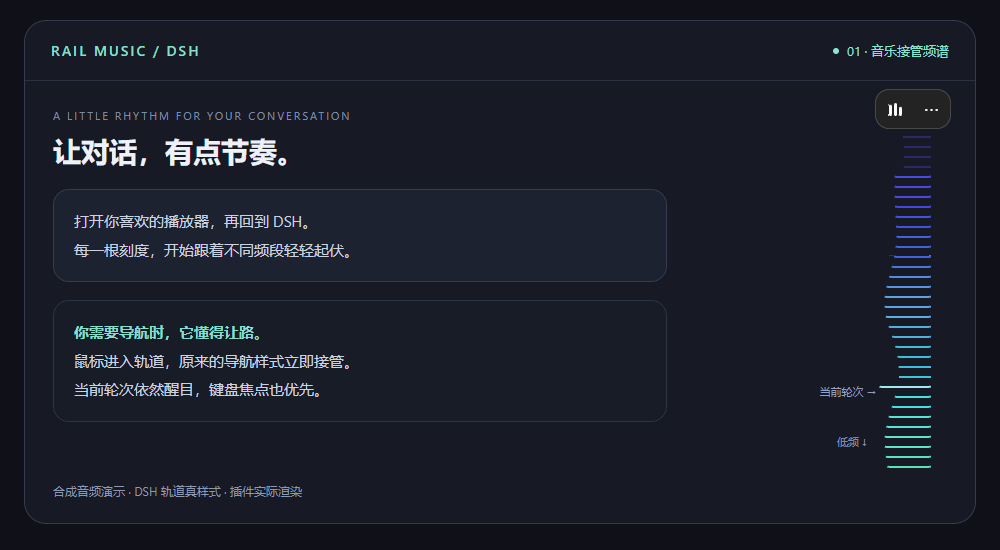
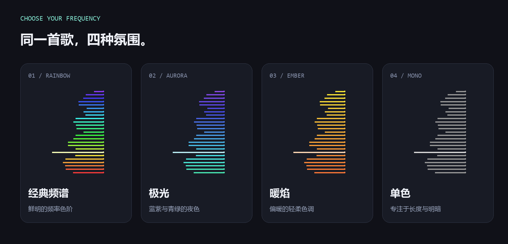
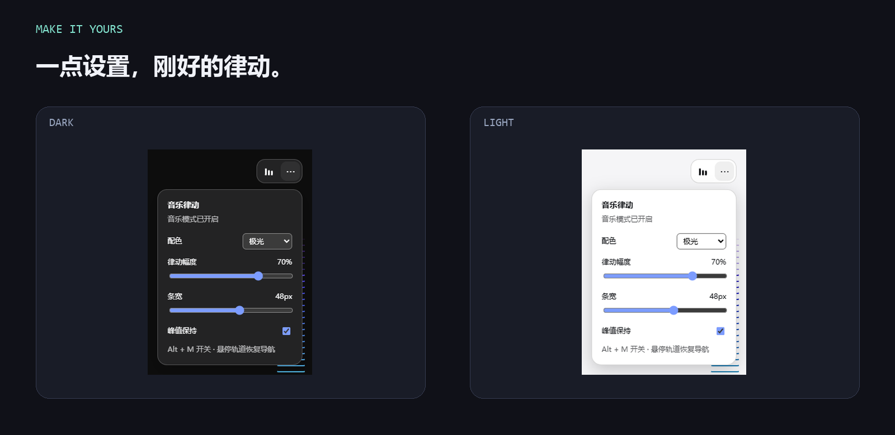
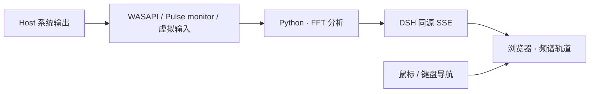

<div align="center">



# DSH Rail Music

**让对话，有点节奏。**

把电脑正在播放的声音，变成 DSH 对话右侧的一条律动频谱。<br>
每根刻度跟着自己的频段起伏；你开始导航时，原来的轨道立即接管。

[](CHANGELOG.md)
[](#兼容性)
[](#安装)
[](LICENSE)

[看看效果](#看看效果) · [开始安装](#安装) · [选择配色](#四种配色) · [版本兼容](#兼容性) · [常见问题](#常见问题)

</div>

## 看看效果

<picture>
  <source media="(prefers-reduced-motion: reduce)" srcset="docs/assets/demo-still.png">
  
</picture>

<sub>动图由合成频段数据驱动，使用 DSH 轨道真样式和插件实际渲染；演示画布是专用测试页。封面与配色卡片为原创示意图。</sub>

**放一首歌，继续你的对话。** 声音来自音乐播放器、浏览器视频或本地文件，经过系统混音或已配置的虚拟音频路由，轨道就能响应。戴着耳机也可以使用。

**三个系统，三条采音路径：** Windows 用 WASAPI loopback；Linux 用 PulseAudio / PipeWire monitor；macOS 用 BlackHole 等已配置的虚拟输入。macOS 需要额外音频路由；Linux/macOS 已实现适配，当前尚未完成实机录音验证。[平台设置指南 →](docs/PLATFORMS.md)

| 🎧 听见节奏 | 🧭 保留导航 | 🎨 调成你的风格 |
| --- | --- | --- |
| 低频在底部，高频在顶部；不同刻度呈现不同频段的能量。 | 鼠标悬停或键盘进入时交还原样式，当前轮次保持醒目。 | 四种配色、条宽、律动幅度和可选峰值保持，都能在小面板里调整。 |

### 它还做了这些小事

- **用 DSH 自己的开关。** Plugins 页面启用或停用，客户端资源随插件加载与卸载。
- **一个快捷键。** `Alt + M` 暂停或恢复；右上角电平按钮也能控制。
- **给原有控件留位置。** 右上角入口自动避开 DSH 的顶部栏和侧栏标签，设置向下展开，宿主菜单与弹窗保持优先层级。
- **记得你的选择。** 配色、幅度、条宽、峰值保持与音乐模式开关保存在当前站点。
- **让安静归于安静。** 持续静音时收起音乐覆盖；标签页隐藏时停止绘制并断开浏览器音频流。
- **沿用现有连接。** 分析结果通过 DSH 的同源服务发送，插件不额外监听网络端口。

## 安装

适用于 **Windows、Linux、macOS 上的 DSH Web**，需满足对应采音条件。推荐 **DSH 0.2.0-rc.2 + Python 3.11**；Agent 会检查环境和平台音频路由，完整范围见[兼容性](#兼容性)。

### 复制这段，让 Agent 帮你装好

把下面的提示词交给能访问你电脑、执行终端命令的 Agent。

```text
请帮我在这台电脑上安装并启用 DSH Rail Music 插件。
插件仓库：https://github.com/YOU-SHOULD-KNOW-ME/dsh-rail-music
目标：让 DSH Web 对话右侧的轮次导航轨道随本机正在播放的声音律动。

请直接完成安装和配置，按下面的顺序执行：
1. 读取 README.md、COMPATIBILITY.md、docs/PLATFORMS.md 和 requirements.txt。
2. 检查操作系统、DSH 版本、Web profile 的位置和可用 Python。
   不兼容时说明原因，不要自动升级或替换我的 DSH。
   缺少 Python 时，安装符合仓库要求的版本。
3. 复用合适的 Python，优先使用插件专用虚拟环境安装 SoundCard/NumPy。
   Linux 确认 libpulse 与 PulseAudio / pipewire-pulse 会话可用。
   macOS 按平台指南准备 BlackHole 等虚拟输入及多输出路由；
   不要改用内置麦克风，需要我操作权限或路由界面时告诉我。
   记录解释器的绝对路径。
4. 执行以下安装命令；若已安装，检查现状，避免重复配置：
   dsh plugin --profile web add github:YOU-SHOULD-KNOW-ME/dsh-rail-music
5. 检查 cordis.patch.yml，必要时为 dsh-rail-music 设置 pythonPath。
   修改前备份，保留其他插件配置和本插件已有设置。
   注意 config 覆盖会替换整个对象。
6. 确认插件启用，完成首次加载所需的 DSH Web 重启和页面刷新。
   如果会中断当前任务，先完成安装，再告诉我最后的重启步骤。
7. 检查 Host 采集和浏览器连接。有浏览器控制能力时，打开带轨道的对话，
   验证控制条与律动效果。需要我播放音乐时告诉我。
   只验证安装、连接或模拟数据时，请说明范围。

结束后请简要报告：安装结果、DSH 版本、Python 路径、改动的配置文件、已验证的项目，以及还需要我完成的步骤。
```

**复制 → 交给 Agent → 放一首歌。** Agent 会处理依赖和配置；安装成功后，右上角会出现三格电平按钮和 `⋯`。你也可以把本地源码目录发给 Agent，让它使用 `link:` 安装。

<details>
<summary><strong>我想自己安装：展开手动步骤</strong></summary>

### 01 / 装好采音依赖

Windows 在 PowerShell 中执行：

```powershell
python -m pip install soundcard numpy
python -c "import soundcard, numpy; print('Audio dependencies ready')"
```

出现 `Audio dependencies ready`，说明这份 Python 可以用于插件。

Linux/macOS 建议用 `python3` 创建专用虚拟环境，再安装 `requirements.txt`。Linux 还需 PulseAudio 兼容服务；macOS 还需 BlackHole 与多输出路由。[按你的系统完成设置 →](docs/PLATFORMS.md)

### 02 / 把插件交给 DSH

安装本插件：

```powershell
dsh plugin --profile web add github:YOU-SHOULD-KNOW-ME/dsh-rail-music
```

<details>
<summary>从下载的源码安装 / 本地开发</summary>

将源码下载或解压到固定位置，再执行：

```powershell
python -m pip install -r D:\Plugins\dsh-rail-music\requirements.txt
dsh plugin --profile web add link:D:\Plugins\dsh-rail-music
```

路径按你的实际位置替换。`link:` 会引用该目录，后续请保留它。源码已带可用的 Host 模块和浏览器工厂，安装时无需运行客户端构建。

</details>

<details>
<summary>Python 不在 PATH 中，或 DSH 找到了另一份 Python？</summary>

在 `~/.dsh/profiles/web/cordis.patch.yml` 里添加同一插件 id 的配置，填入能够导入 SoundCard/NumPy 的解释器路径：

```yaml
- id: dsh-rail-music
  config:
    pythonPath: 'C:\Python311\python.exe'
```

用 `python -c "import sys; print(sys.executable)"` 可以找到刚才安装依赖的解释器。Windows 下 `~/.dsh` 默认位于用户目录；设置了 `DSH_HOME` 时以该路径为准。覆盖 config 会替换整个对象，需要保留你想使用的其他字段。

</details>

### 03 / 重启、刷新，然后放一首歌

重启 `dsh web`，刷新已有页面，在 **Plugins → dsh-rail-music** 中确认已启用。打开有轮次导航轨道的对话，再播放音乐。

**成功的样子：** 右上角出现三格电平按钮和 `⋯`；有声音时，轨道开始律动。点击 `⋯` 就能调整配色。

> 首次安装或从 0.2.0 升级后，需要重启并刷新，以更新 DSH 缓存的客户端声明。之后 Plugins 页开关可实时管理插件。Python 和声卡仍有初始化耗时，控制界面先出现，再开始接收音频。

升级到 0.3.0 后也请重启 DSH 并刷新页面，使 Host 和采集 helper 加载新的平台适配代码。

</details>

<details>
<summary>未来从 npm 安装</summary>

仅在插件已经发布到 npm 后使用：

```powershell
dsh plugin --profile web add dsh-rail-music
```

当前页面没有声明 npm 包已经发布；GitHub 或本地源码安装是现阶段的入口。

</details>

## 四种配色



| 主题 | 氛围 | 标识 |
| --- | --- | --- |
| **经典频谱** | 鲜明的频率色阶，传统频谱的观感。 | `rainbow` |
| **极光** | 蓝紫与青绿，适合深色界面。 | `aurora` |
| **暖焰** | 橙黄暖色，给轨道一点温度。 | `ember` |
| **单色** | 保留长度和明暗，减少色彩干扰。 | `mono` |

默认使用经典频谱。想试试首页的极光效果，可以点 `⋯` 切换，也可以执行：

```javascript
__railMusic.setTheme('aurora')
```

## 刚刚好的律动



面板提供最常用的调整，支持深浅主题。截图来自 DSH 样式测试页；与其他插件同时使用时，控制条的占位仍需在你的布局中确认。

| 调整 | 怎么理解 | 建议起点 |
| --- | --- | --- |
| 律动幅度 | 决定声音能让条长变化多少。 | `0.6` |
| 条宽 | 给频谱更多伸展空间；容器一起调整。 | `32px` |
| 峰值保持 | 让频段峰值短暂停留，再回落。 | 先关闭，喜欢音量表观感时再开启 |
| `balanced` 档 | 2048 点分析窗，保留较细的低频分辨率。 | 默认 |
| `responsive` 档 | 1024 点分析窗，瞬态更敏捷，低频分辨率较粗。 | 更在意鼓点响应时试用 |

前三项在面板里即时生效；分析档位在 Host 配置里更改。可以用这份极光配置作为起点：

```yaml
- id: dsh-rail-music
  config:
    theme: aurora
    depth: 0.6
    barWidth: 32
    profile: balanced
```

需要指定 `pythonPath` 时，把它也写进同一 config 对象。浏览器保存的配色、幅度和条宽优先于 Host 默认值。更多参数和重置方法见[配置与开发指南](docs/DEVELOPMENT.md)。

## 操作小抄

| 你想做什么 | 操作 |
| --- | --- |
| 暂停 / 恢复律动 | `Alt + M` 或点击三格电平按钮 |
| 调整外观 | 点击右上角 `⋯`；`Esc` 关闭设置 |
| 用轨道跳到某轮对话 | 鼠标或键盘进入轨道，导航样式优先 |
| 停用整个插件 | DSH 的 Plugins 页面开关 |
| 查看当前状态 | 浏览器控制台执行 `__railMusic.status()` |
| 撤下当前页的音乐层与控制条 | `__railMusic.disable()`；可再用 `enable()` 启用 |

## 兼容性

本插件采集 **运行 DSH 的 Host** 的系统音频，面向 **`dsh web`**。

| 项目 | 支持范围 |
| --- | --- |
| 推荐 DSH | **0.2.0-rc.2** |
| 已核查的 DSH 版本 | 0.1.7-alpha.1 / alpha.2 / rc.1 / rc.2，0.2.0-rc.1 / rc.2 |
| Node | 建议 **24**；上述 DSH 源码要求 `^22.19.0 \|\| >=24.0.0` |
| Python | 3.9+，本地采集验证使用 3.11；需 SoundCard 和 NumPy |
| Windows | WASAPI 共享模式 loopback；真实采集验证通过 |
| Linux | PulseAudio / PipeWire 的 sink monitor；需 libpulse 和同用户音频会话 |
| macOS | CoreAudio 虚拟输入，如 BlackHole 2ch；需路由与输入权限 |

六个 DSH 版本通过接口审查及各自轨道样式回归，尚未逐一启动六套完整应用。Linux/macOS 适配通过模拟设备测试，实机验收待完成；纯 ALSA/JACK、DSH 桌面 carrier 和未来版本不在当前验收范围。[兼容性报告](COMPATIBILITY.md) · [平台准备](docs/PLATFORMS.md)

## 常见问题

<details>
<summary><strong>安装了，却没有律动？</strong></summary>

先按这个顺序检查：

1. 首次安装后是否重启 `dsh web` 并刷新页面？
2. Plugins 中是否启用，并打开了带轮次导航的对话？
3. 是否正在播放声音，音乐模式是否暂停？
4. DSH 使用的 Python 是否能导入 SoundCard/NumPy？
5. 系统是否开启“减少动态效果”？此时插件默认暂停。

查看 `__railMusic.status()`：`connected`、`railFound`、`rms` 与 `frameAgeMs` 有助于定位。也可以配置 `logFile` 查看采集错误。

</details>

<details>
<summary><strong>播放器有声音，插件却显示静音？</strong></summary>

检查播放器是否使用 WASAPI 独占输出。插件读取共享混音，独占输出需切回共享模式。显式配置设备时，也要确认名称或设备 ID 正确。

Linux 检查默认 sink 的 monitor 及音频服务；macOS 确认播放声音进入了 BlackHole/虚拟输入、实际启动器有录音权限。切换耳机后也要更新多输出路由。

</details>

<details>
<summary><strong>会显示通知、视频等声音吗？</strong></summary>

会。当前分析的是系统输出混音，所有进入该混音的声音都会影响频谱；戴耳机同样适用。希望只看音乐时，可以暂停其他声音来源。

</details>

<details>
<summary><strong>从另一台电脑打开 DSH，采的是哪台电脑？</strong></summary>

采集发生在运行 DSH 的 Host 上。浏览器收到的是频段、电平和节奏数据。远程访问的网络时延会影响显示体验。

</details>

<details>
<summary><strong>为什么 Plugins 开关仍可能短暂显示处理中？</strong></summary>

插件已去掉固定 1.5 秒启动等待，停用时主动关闭音频流并撤下界面。DSH 的 Plugins 操作还包含保存 profile 和热重载流程，首次声音也包含 Python 与设备初始化。

测量范围和优化记录见[审查与优化报告](REVIEW_AND_OPTIMIZATION.md)。当前没有承诺真实听觉到屏幕的端到端同步延迟。

</details>

<details>
<summary><strong>我想彻底关闭，或恢复默认设置。</strong></summary>

Plugins 页面停用会卸载运行资源。只想暂停当前页，用电平按钮或 `Alt + M`。

要移除当前站点保存的偏好，在控制台执行后刷新：

```javascript
localStorage.removeItem('dsh-rail-music:v2')
```

系统设置了“减少动态效果”时，音乐模式默认暂停。希望主动覆盖此设置，可以执行 `__railMusic.force()`。

</details>

<details>
<summary><strong>安装遇到 ERR_PNPM_UNEXPECTED_STORE。</strong></summary>

这通常是 profile 使用的 pnpm store 版本与当前工具不一致。先检查 DSH 使用的 pnpm 和 profile 安装环境；本地安装与排查说明见[配置与开发指南](docs/DEVELOPMENT.md)。修复后重启 DSH。

</details>

## 声音如何来到轨道上



Host 看管采集进程，经标准输出接收分析帧，由 DSH 自己的服务转发。浏览器工厂由 DSH 加载/卸载，音乐层用 CSS 变量驱动刻度。页面接收的是分析结果；声音播放仍由你选择的播放器负责。

## 给想一起改进它的人

想优化配色、排查设备兼容，或为新的 DSH 版本补适配？欢迎带着复现步骤提交 Issue 或 PR。

| 资料 | 内容 |
| --- | --- |
| [配置与开发指南](docs/DEVELOPMENT.md) | 参数、实现机制、测试命令和已知限制 |
| [平台设置指南](docs/PLATFORMS.md) | Linux 音频服务、macOS BlackHole 和设备选择 |
| [兼容性报告](COMPATIBILITY.md) | 发布版本、接口依据和验证范围 |
| [更新记录](CHANGELOG.md) | 每个插件版本的变化 |
| [审查与优化报告](REVIEW_AND_OPTIMIZATION.md) | 延迟、视觉、生命周期优化与测试结果 |
| [GitHub 发布准备](GITHUB_RELEASE.md) | 独立仓库、CI 与源码打包步骤 |

基础检查无需正在播放音乐：

```powershell
npm run check
npm test
python test\analyser.test.py
python test\audio_devices.test.py
```

浏览器与真实声卡测试的准备见开发指南。反馈问题时，可以附上 DSH 版本、操作系统/Python 版本和输出设备。分享诊断前请检查日志中的本地路径。

<details>
<summary>English overview</summary>

**A little rhythm for your DSH conversations.** Rail Music turns Host audio into a spectrum on DSH's conversation turn-navigation rail. Each mark follows its frequency band; pointer and keyboard navigation restore the native styling.

Features include four themes, persistent settings, optional peak hold, `Alt + M` pause/resume, and native DSH activation/teardown. Audio uses Windows WASAPI loopback, Linux PulseAudio/PipeWire monitors, or a routed macOS virtual input such as BlackHole. Analysis frames use DSH's same-origin SSE, without opening an extra port.

Recommended: DSH **0.2.0-rc.2**, Node **24**, Python **3.11** with SoundCard and NumPy. See [COMPATIBILITY.md](COMPATIBILITY.md) and [platform setup](docs/PLATFORMS.md). Linux/macOS routing is implemented and unit-tested; hardware recording validation is pending. Web profile only.

Copy this prompt to an agent that can access your computer and run terminal commands.

```text
Install and enable DSH Rail Music on this computer for the DSH Web profile.
Repository: https://github.com/YOU-SHOULD-KNOW-ME/dsh-rail-music

1. Read README.md, COMPATIBILITY.md, docs/PLATFORMS.md and requirements.txt. Check OS,
   DSH version, the Web profile location and available Python interpreters.
   Report incompatibility without upgrading or replacing DSH.
   Install a supported Python version if none is available.
2. Use a suitable Python, preferably a dedicated venv, and install dependencies.
   Check libpulse and PulseAudio/pipewire-pulse on Linux; prepare a routed
   virtual audio input on macOS, asking for required permission/routing steps.
   Never fall back to the default microphone. Verify imports.
3. Check existing installations, then install with:
   dsh plugin --profile web add github:YOU-SHOULD-KNOW-ME/dsh-rail-music
4. Back up cordis.patch.yml. Set pythonPath if needed, preserving all existing
   plugin settings. A config override replaces the entire object.
5. Enable the plugin, restart DSH Web and refresh the page when possible.
   If restarting would interrupt this task, explain the remaining restart step.
6. Check Host capture and browser connection. With browser access, verify the
   controls in a conversation with a turn rail; ask me to play audio if needed.
   Distinguish installation checks, real audio checks and simulated tests.
7. Report the result, DSH version, Python path, changed files and remaining steps.
```

Manual commands are in the expandable installation section above. The GIF uses synthetic band frames with the actual plugin renderer and DSH rail styles.

</details>

---

<div align="center">

**一条小轨道，陪你把一首歌听完。**

MIT · [DeepSeek Harness](https://github.com/deepseek-ai/deepseek-harness) · [页面设计参考](docs/README_DESIGN.md)

</div>
