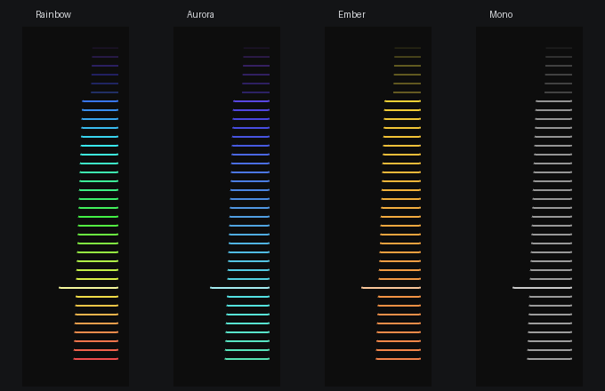
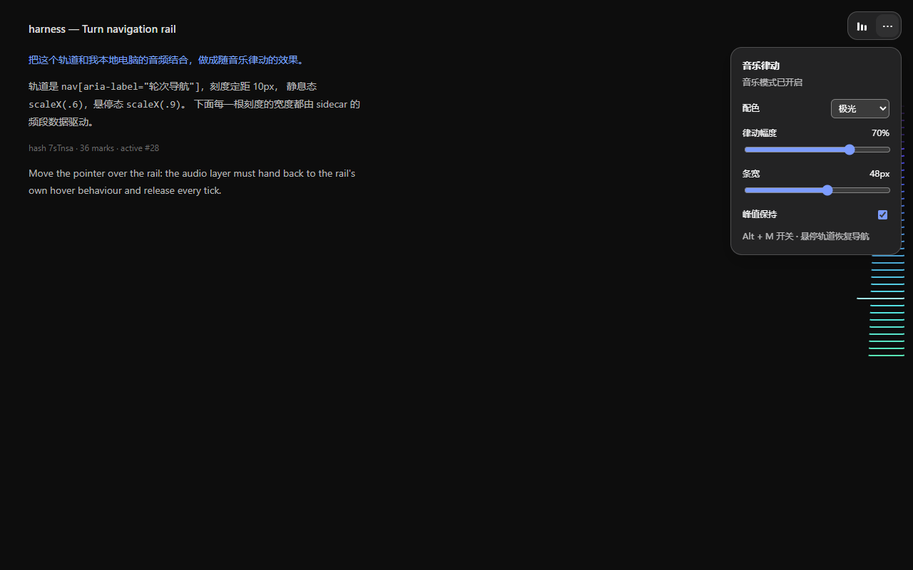
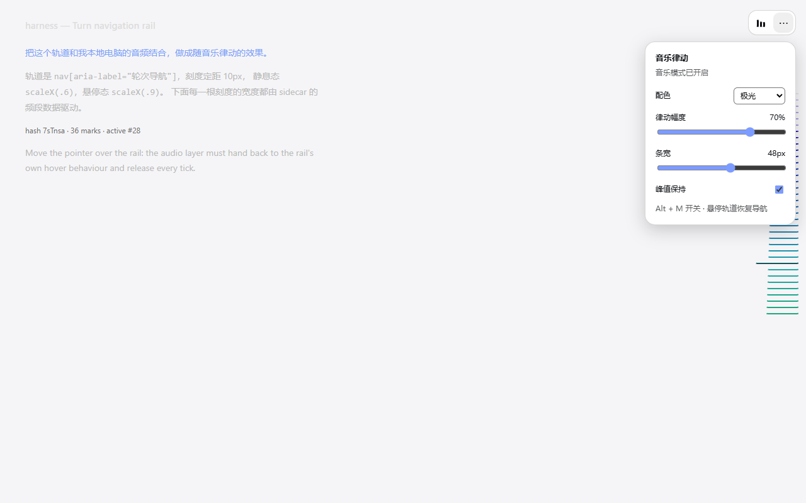

# DSH Rail Music 审查与优化报告

首次审查：2026-10-02；当前代码版本：0.3.0。

范围：`README.md`、采集 helper、Host/SSE、浏览器绘制与交互、已有验证工具。已直接修改插件，并补充回归验证。原生客户端声明从 0.2.0 升级后需首次重启 DSH 并刷新页面。

## 0.3.0 平台更新（2026-10-04）

新增 `lib/audio_devices.py`，按 Python 的平台选择 WASAPI loopback、Linux PulseAudio/PipeWire monitor 或 macOS 已路由的虚拟输入。Linux 默认 sink 与 monitor ID 分开解析，macOS 不要求 `isloopback=True`，默认只选择已识别的虚拟设备；没有设备时给出平台设置错误，不回退到默认麦克风。单/双声道参数、准确 ID、重名选择、设备变化与列表诊断均有覆盖。

12 项模拟设备测试、4 项 DSP 测试和 Host 协议回归通过。Windows 真实 6 秒采集收到 409 帧且无重启；激活约 1.7ms、首帧约 714ms、退出请求约 0.6ms，8 次快速取消没有残留测试进程。当前机器没有已安装的 Linux WSL 发行版，也不是 macOS，Linux/macOS 实机录音未验证。已提供三平台 CI 检查和 Linux null-sink 真实采集任务，但尚未在 GitHub 执行。

平台安装、macOS BlackHole 多输出路由、Linux 用户会话与音频库要求见[平台指南](docs/PLATFORMS.md)。以下原有章节为 0.2.x 历史审查记录；其中旧的 Windows-only 描述以本节、当前 README 与平台指南为准。

## 0. 0.2.1：Plugins 页开关卡顿的专项优化

### 2026-10-03：控制条移至右上角

控制条改为右上方固定入口，按真实 header/banner/toolbar/tablist 的几何自动避让；设置面板向下展开，限制为视口剩余高度。布局变化用 ResizeObserver 与按需合并的 rAF 更新，暂停时保留布局监听，完全卸载时释放。层级降为 20，低于 DSH 原生菜单、提示与弹窗。

当前浏览器回归共 29 项通过，新增入口方向、顶部栏避让、标题栏尺寸变化、右侧栏标签避让、移除工具栏后的恢复及宿主弹出层优先检查。原生生命周期与六版本轨道回归仍通过。真实 DSH 页面已检查顶部栏和右侧栏开合：顶部栏约 76px 时入口约在 y=85px；右侧标签栏约 38px 时入口约在 y=46px，没有覆盖其原有按钮。README、设置截图和合成音频演示已更新；仍不保证所有第三方插件的任意浮层布局。

用户确认卡顿入口是 **DSH 的 Plugins 页面开关**。本轮将浏览器端从页面加载时的 script 注入迁移到正式 `dsh.client` 工厂与 `./client` 导出。DSH 的客户端插件 effect 管理音频连接、动画、样式、快捷键和可见性/动效偏好监听器；实时启用读取当前 Host 配置，而不是依赖旧页面的注入值。

### 已处理的额外等待

- 默认 `startDelayMs` 从 1500 改为 0。Host 先注册路由，采集启动放在下一轮事件循环，Python 初始化不会阻塞插件激活。
- 停用时主动向仍打开的 SSE 发送 `shutdown` 并关闭流。浏览器立即清理，无需先等 1 秒帧超时，再等增益衰减。
- 原生卸载会撤下全局 API 与所有监听器；重新加载不会叠加快捷键，也不会把包级停用保存成用户的 Music Mode 暂停偏好。
- 配置请求被取消后不得重新创建控制条；旧实例的重复清理不会删除新实例的界面。
- helper 通过 stdin EOF 退出，后备终止请求异步进行，DSH 的开关请求不等待音频进程冷启动或退出。

### 本轮验证与测量

| 测量 | 本次结果 | 测量范围 |
| --- | --- | --- |
| 真实 Host `apply()` | 约 1.3ms | 插件路由注册与启动安排，不含 DSH manager |
| 真实 Host disposer | 约 1.0ms | 关闭流、撤销注册、发出 helper 退出请求 |
| 首个真实音频帧 | 约 895ms | 本次 Python/NumPy/SoundCard 与设备的冷启动；没有原先固定 1500ms 等待 |
| 原生浏览器 apply 调用 | 约 1.6ms | 工厂 effect 立即返回，不等待 HTTP 或声音 |
| 浏览器卸载 p95 | 约 1.0ms | 15 次加载/卸载 fixture，非 Plugins 页总请求 |
| 真实 DSH Plugins 停用请求 | 约 1019ms | 当前驻留进程；含 profile 保存和 DSH 热重载 |
| 真实 DSH Plugins 启用请求 | 约 723ms | 当前驻留进程；原生声明缓存尚未经过首次重启更新 |
| 快速中止真实 helper | 8 次循环后无测试所属 Python 残留 | 包含在 Python 导入期间就关闭的情况 |

本轮原生浏览器生命周期测试还覆盖：懒注册、当前配置读取、偏好保留、快捷键唯一性、shutdown、延后响应取消以及旧实例的迟到清理；原有 23 项交互测试与真实 Host 冒烟检查仍通过。

**Plugins 页的整个请求仍由 DSH 保存配置、更新 Include/Loader、进行激活检查后返回。插件的局部毫秒结果不能当成整个开关请求耗时。** 本次没有修改 DSH 核心仓库，也未重启用户正在运行的 DSH；当前页面的客户端声明缓存仍需首次重启才能使用原生模块。实际页面验收做了一次关闭与恢复，并保留了启用状态。

GitHub 准备已补充 `requirements.txt`、`CHANGELOG.md`、Windows CI、包文件清单与源码 ZIP 命令。源码包只包含明确的项目文件，不带采集日志、浏览器抓包、Python 缓存或用户 profile。操作见 [GitHub 发布准备](GITHUB_RELEASE.md)。

以下章节保留上一轮 0.2.0 的审查与验证记录；涉及 Host-only/script 注入的旧架构描述，以本节和当前 README 的原生插件说明为准。

## 1. 结论与推荐设置

这套插件的基础结构适合继续使用：WASAPI loopback 捕获系统混音，Python 负责 FFT，Node 通过已有服务转发，浏览器只处理轨道显示。维持 Host-only、零 npm 运行依赖和同源 SSE。

优先解决的实际问题是静音恢复的额外等待、设备名称枚举引发的原生崩溃、关闭流程异常和设置传递缺失。视觉方向采用桌面播放器常见的紧凑频谱单元：条长表达能量、固定配色表达频率位置、可选峰值保持，导航操作始终优先。

建议日常使用：**极光配色、32px 条宽、0.5–0.7 幅度、balanced 档、峰值保持关闭**。希望鼓点起伏更直接时，试用 responsive；喜欢较缓的音量表观感时开启峰值保持。

### 本次结果

| 项目 | 结果 | 证据边界 |
| --- | --- | --- |
| balanced 真实采集与 SSE | 6 秒收到约 370 帧；8 项冒烟检查通过 | 包含启动耗时，不能把平均值当设备帧率上限 |
| responsive 真实采集与 SSE | 6 秒收到约 495 帧；8 项冒烟检查通过 | 1024 点窗、请求 100fps，实际速率受系统影响 |
| 45 秒采集稳定性 | 3,543 帧、0 次重启、45/45 次状态采样有新帧 | 是这台机器、本次设备与环境的结果 |
| 真实音频到浏览器 | 原有 17 项检查全部通过 | 真实音频、真实路由、DSH 样式 harness；没有完整应用布局 |
| 频谱差异 | 普通条平均跨度 0.376 scaleX，约 12.0px；峰值约 13.8px | 本次正在播放的音频样本，非所有歌曲保证 |
| 独立浏览器回归 | 23 项通过 | Edge、合成音频帧、真实轨道样式与 DOM |
| 休眠绘制唤醒 | 合成帧测试约 2–3ms | 从帧注入到绘制循环重新工作，非听觉到屏幕延迟 |
| DSP 回归 | 4 项通过，覆盖 12 种采样率/窗长组合 | 不打开声卡，验证算法边界与信号保真 |
| Host 协议回归 | 5 组通过 | 参数归一化、10,000 帧慢消费者、取消、配置注入与释放 |

**本次没有获得可靠的“用户听到声音 → 屏幕显示”的端到端同步测量值。** 已验证的是具体等待环节被移除、真实采集持续工作、真实频谱成功绘制与导航还原。

## 2. 审查发现与修复

优先级含义：P0 为可导致采集失效；P1 为影响使用或同步体验；P2 为视觉、性能和测量可信度问题。

| 优先级 | 原问题 | 影响 | 本次处理 |
| --- | --- | --- | --- |
| P0 | 默认路径调用 `speaker.name` 和 `get_microphone()`；SoundCard 即使匹配 ID 也先构建所有设备名称表 | 本环境中原版与早期修改版均出现 `0xC0000374` 原生堆崩溃 | 使用公开的 `all_microphones()` API，先按设备 ID 选择 loopback，避免默认路径名称枚举；随后通过冒烟与 45 秒测试 |
| P1 | `disable()` 对 `{dot, bars}` 对象调用 `remove()` | 点击关闭会抛错，后续清理不完成 | 明确移除控制根节点；释放连接、定时器、监听器、CSS 和状态；区分暂停与完全撤下 |
| P1 | idle 时 250ms 轮询，SSE 只更新帧缓存 | 下一段音乐可能等到轮询结束才开始绘制 | 有效音频帧直接唤醒 rAF，保持单一调度链；静音时仍可低频巡检 |
| P1 | 接管增益时间常数为 120ms | 音乐恢复、离开轨道后的前几个鼓点被长淡入削弱 | 缩短到 25ms；保留频段快起慢落包络，不增加 CSS transform 平滑 |
| P1 | Host 未注入 `barWidth` | README 配置与实际浏览器行为不一致 | 注入条宽、主题、档位和版本；浏览器本地设置可覆盖默认值 |
| P1 | 左右声道先取样本平均 | 反相立体声可能被抵消成静音 | 各声道 FFT 后按功率合并，RMS 也基于声道能量；反相回归与单声道结果一致 |
| P1 | 悬停退出音乐层依赖渐变，键盘焦点没有整体交还导航 | 音乐可能短暂干扰导航与焦点反馈 | pointer/focus 进入立即撤下覆盖；保留固定命中区，防止几何抖动 |
| P2 | SSE 对慢消费者无限 `enqueue()` | 长积压、内存增长、旧帧回放 | 插件流最多保留一份排队数据和一份最新待发数据；慢消费者合并中间帧 |
| P2 | 每次绘制分配四个 typed array，指示器动画改变 height | 不必要的 GC 与布局工作 | 按刻度数量复用缓冲区；指示器固定高度，通过 scaleY 绘制，避免二次过渡 |
| P2 | 位于 22px 透明圆点中的单向关闭入口 | 难发现、无法鼠标恢复，也没有设置入口 | 32px 按钮、可暂停/恢复、独立设置入口、原生表单与可见焦点 |
| P2 | 当前条 HSL 明度 66，而普通条可能达到 68 | 当前轮次的强调不稳定 | 当前条明度 76–82、普通条上限 64；浅色主题使用相反的明暗关系；当前条仍不短于其他条 |
| P2 | 增加频段数量时，倾斜补偿随频段数量成倍增加 | 48 频段与 24 频段的整体形状不同 | 按 24 频段基准归一化补偿跨度 |
| P2 | 非法数值配置可变成 NaN；低采样率下频率上限超出 Nyquist | 启动参数异常或无效频段 | 有限值检查、整数频段数、窗长白名单；最高频率限制到采样率的一半 |
| P2 | 首次连接或 helper 重启被当成一次 beat | 无实际起音时全条突然脉冲 | 初次只建立 beat 基准，只有后续计数增加才发脉冲 |
| P2 | 后台页仍保持 SSE；减少动态效果只在启动时检查 | 无效绘制与不符合当前系统设置 | 隐藏页断开 SSE、停止绘制，回到前台重连；动态开启减少动效时暂停 |
| P2 | `soak.mjs` 假定累计帧计数会在重启时下降 | 崩溃循环可能误报“0 次重启” | Host 增加真实重启计数，soak 改用该计数 |
| P2 | 冒烟工具超时后重复创建 `reader.read()` | 帧被悬挂的旧 read 消费，统计失真 | 复用同一个未完成 read |
| P2 | 测试服务器以请求 `close` 作为 SSE 结束信号 | GET 解析结束可能被当成断流 | 改为监听响应 `close` |
| P2 | 延迟脚本的浏览器参数已经过时，且称为“端到端” | 结果难以对应当前产品体验 | 更新包络参数并明确测量参考；README 同步纠正 |

设备名称读取与崩溃之间存在可复现关联，绕开后本次测试通过；尚不能据此确认 SoundCard、CFFI、驱动中的具体原生缺陷。没有改写第三方库或调整系统音频设备。

## 3. 延迟优化与档位取舍

### 3.1 把延迟拆成可解释的环节

```text
系统混音 → WASAPI 请求块 → FFT 分析窗 → stdout → Node/SSE
        → 浏览器接收 → 包络跟随 → rAF → 浏览器合成与屏幕刷新
```

还有播放器自己的输出缓冲、音频引擎/驱动与显示器延迟。这些部分不能用一个 `fps` 参数解决。

| 项目，48kHz | balanced | responsive | 性质 |
| --- | --- | --- | --- |
| 默认分析频率请求 | 80fps | 100fps | 请求值，非保证值 |
| hop / blocksize 请求 | 600 帧 / 12.5ms | 480 帧 / 10ms | 驱动实际缓冲可能不同 |
| FFT 窗长 | 2048 帧 / 42.7ms | 1024 帧 / 21.3ms | 计算值 |
| 窗中心时间尺度 | 约 21.3ms | 约 10.7ms | 窗中心滞后尺度，不能直接当瞬态实测 |
| FFT bin 间距 | 约 23.4Hz | 约 46.9Hz | 低频分辨能力的取舍 |
| 每频段 attack / release | 6 / 30ms | 6 / 30ms | 包络时间常数 |
| 全局电平 attack / release | 12 / 60ms | 12 / 60ms | 包络时间常数 |
| 接管增益 attack | 25ms | 25ms | 音乐恢复与导航结束后的接管；持续播放期间不重复淡入 |

2048 点窗的总长是 42.7ms，README 原来的“约 21ms”更接近窗中心时间尺度。80fps 的 hop 是 12.5ms，而不是 10ms。

原 120ms 接管时间常数达到 90% 约需 276ms；25ms 约需 58ms。这是指数包络的计算结果，解释恢复时的视觉钝感；它不是固定传输等待，也不是本次音画同步实测。

### 3.2 不把最短窗直接设成默认

低频频段数多于 FFT 能提供的独立频点时，多个频段会共享频点。1024 点窗会让鼓点更敏捷，也更难区分相邻低音。因而默认保持 balanced，把 responsive 提供给偏重节奏反馈的使用场景。显式 `window` 与 `fps` 可以覆盖档位默认。

### 3.3 后续可靠测量方式

1. 使用播放器已经稳定输出的可重复瞬态，不把调用 `play()` 的时间直接当实际出声时间。
2. 记录 helper 生成时刻、Host 接收时刻、浏览器接收与绘制时刻，统一或校准时钟。
3. 用摄像/同步采集实际声音和屏幕变化，对齐多个瞬态，输出 p50/p95；标明音频设备与屏幕刷新率。
4. 先关闭峰值保持，在相同歌曲、音量、主题、窗口大小下对比两个档位。

当前 `receiveToPaintMs` 只表示浏览器最近帧的年龄，不包括采音、传输、显示器刷新，也不应称为总延迟。

## 4. 如何融合桌面播放器的律动单元

### 4.1 参考机制

借鉴 foobar2000 类频谱显示、经典 Winamp 条形分析器及 Rainmeter 桌面音频组件的通用显示范式。本次实际核验的是 [Rainmeter AudioLevel 官方文档](https://docs.rainmeter.net/manual/plugins/audiolevel/)：它说明了 FFTSize、FFTOverlap、FFTAttack/FFTDecay、对数频段及频率范围的作用。其他产品名用于描述风格参考，没有声称核验其当前版本或源码。

| 桌面组件常见机制 | 在 DSH 中的融合方式 | 当前状态 |
| --- | --- | --- |
| 对数频谱条 | 低频在底、高频在顶，条长对应频段能量 | 保留并修复立体声能量 |
| 快起慢落 | 快速显示瞬态，下降保留短尾部 | 已实现；单一 JS 包络拥有平滑 |
| 峰值保持 | 可选保持各频段峰值约 150ms，再以归一化 2.5/s 回落 | 已实现；关闭为默认 |
| 统一皮肤与配色 | 极光、暖焰、经典频谱、单色，沿用 DSH 背景/文字 token | 已实现，深浅主题检查 |
| 紧凑电平显示 | 三格小电平与轨道共用频段数据，固定尺寸、可暂停恢复 | 已实现 |
| 可收起的设置 | 原生 details 与表单，调整条宽、幅度、配色、峰值保持 | 已实现，Esc 与焦点可用 |
| 独立桌面悬浮窗 | 未来复用同一数据源，增加单独显示窗口与生命周期 | 未实现，属于扩展方向 |

当前峰值保持作用在频段显示包络上，并没有画独立的峰值小横线。它会让低谷收缩稍晚，是一种观感选择。独立小横线可能与导航焦点环、加载状态冲突，适合先做在独立面板里。

### 4.2 频谱与导航共用空间的规则

- 未操作时，彩色频谱接管刻度；当前轮次具有更强对比度，并保证不短于其他条。
- 鼠标或键盘进入时，立即撤下音乐覆盖，由 DSH 原始白灰色、宽度与焦点环接管。
- 命中区域在音乐模式中保持固定宽度，悬停不改变几何，避免闪烁循环。
- 音频 transform 不叠加 CSS transition；控制按钮不使用持续装饰动效。
- 缩短窗长、峰值保持与较强律动幅度作为可选择的观感设置。

### 4.3 四种配色



上图取自相同样式 harness 的不同渲染帧，用于展示皮肤，不用于比较响应时间。

| 配色 | 适用场景 | 建议 |
| --- | --- | --- |
| 经典频谱 rainbow | 希望很直观地看到高低频分布 | 保持兼容默认；较有表现力 |
| 极光 aurora | 深色界面、长期工作、电子/氛围音乐 | 日常推荐；蓝紫到青绿的色域较统一 |
| 暖焰 ember | 暖色桌面、爵士或低频音乐的视觉偏好 | 暖色统一，并不会改变频段分析 |
| 单色 mono | 降低色彩干扰、浅色界面 | 用长度和明暗呈现能量与导航状态 |





以上是 DSH 真样式和类名的测试 harness，页面文字、整体布局与完整 DSH 应用不同。已检查面板对比度和 360px 窄视口；与其他插件/输入区的实际占位仍需在完整应用中检查。

## 5. 新功能与使用方式

### 推荐 Host 配置

在 `~/.dsh/profiles/web/cordis.patch.yml` 中覆盖同一 id 的 config，修改后重启 `dsh web`：

```yaml
- id: dsh-rail-music
  config:
    pythonPath: 'C:\path\to\python.exe'
    logFile: 'C:\path\to\dsh-rail-music\capture.log'
    profile: balanced
    theme: aurora
    barWidth: 32
    depth: 0.6
```

需要更快的瞬态响应时将 `profile` 改为 `responsive`。不同时固定 `fps` 与 `window`，可以让档位选择其默认值。显式值优先，支持窗长 1024/2048/4096。

这份机器配置只是示例，本次没有修改正在使用的 profile 或重启 DSH。

### 即时控制

```javascript
__railMusic.setTheme('aurora')
__railMusic.setDepth(0.6)
__railMusic.setBarWidth(32)
__railMusic.setPeakHold(false)
__railMusic.status()
```

- 按钮或 `Alt+M`：暂停/恢复，暂停后仍能用鼠标开启。
- `⋯`：设置入口，Escape 关闭并回到入口焦点。
- `disable()`：关闭并移除控制条、轨道覆盖与监听器。
- `enable()`：重新启用；减少动态效果开启时拒绝。
- `force()`：用户主动覆盖减少动态效果限制。
- 设置保存在当前站点的 `localStorage`，优先于 Host 的配色、条宽、幅度默认值；开关状态也保留。

恢复 Host 默认：`localStorage.removeItem('dsh-rail-music:v2')`，随后刷新页面。

### 诊断

- 浏览器 `status()` 新增 `theme`、`peakHold`、`profile`、`receivedFrames`、`frameAgeMs`、`receiveToPaintMs`。
- Host `GET /api/rail-music/status` 新增真实 `restarts`，以及采样率、窗长、请求 hop 等分析配置。
- 采集日志保留启动、打开设备、默认设备变化和退出信息；stderr 区分诊断与错误。
- 未显式指定设备时，每秒检查默认输出 ID，变化后重开 recorder 并重置分析状态。实际切换场景尚未验证。

## 6. 验证命令与改动文件

```powershell
$env:RAIL_MUSIC_PYTHON = 'C:\path\to\python.exe'
$env:DSH_CHECKOUT = 'D:\path\to\deepseek-harness'

& $env:RAIL_MUSIC_PYTHON test\analyser.test.py
node test\host.regression.mjs
node test\client.regression.mjs
node test\host.smoke.mjs --seconds 6
node test\host.smoke.mjs --seconds 6 --profile responsive
node test\soak.mjs --seconds 45 --log shots\review-capture.log

# 另开一个终端运行服务器，然后在当前终端验证；真实声音须正在播放
node test\serve.mjs --port 8793
$env:RAIL_MUSIC_URL = 'http://127.0.0.1:8793/'
node tools\verify.mjs
```

| 文件 | 改动 |
| --- | --- |
| `lib/capture.py` | 设备 ID 匹配、可配 FFT 窗、多声道功率分析、Nyquist 限制、设备切换检测、结构化诊断 |
| `lib/index.js` | 配置校验/注入、响应档位、SSE 有界合并、重启计数和分析状态 |
| `lib/client.js` | 音频帧唤醒、生命周期清理、导航优先、主题、峰值保持、控制面板、设置持久化、缓冲复用 |
| `test/analyser.test.py` | 反相立体声、采样率与窗长边界、分块一致性、静音恢复 |
| `test/host.regression.mjs` | 配置、背压、取消、注入与路由释放 |
| `test/client.regression.mjs` | 23 项确定性渲染/交互检查与皮肤截图 |
| `test/host.smoke.mjs`、`test/soak.mjs`、`test/serve.mjs` | 修正读流、重启判断与 SSE 断开信号；支持响应档位验证 |
| `tools/measure-sync.py` | 同步当前包络常数，修正测量口径 |
| `package.json`、`README.md` | 版本 0.2.0、使用方式和测量边界 |

无需新增 npm 运行依赖。Python 仍需 NumPy 与 SoundCard；本次使用现有虚拟环境：Python 3.11、NumPy 2.4.4、SoundCard 0.4.6、CFFI 2.1.1。回归浏览器使用现有 DSH checkout 的 Playwright 与 Edge。

## 7. 后续优化顺序与保留边界

| 顺序 | 工作 | 完成标准 |
| --- | --- | --- |
| 1 | 完整 DSH 现场验收 | 在真实对话、流式输出、切换会话、侧栏开关、窄窗口和其他插件同时存在时，控制条与导航不被遮挡 |
| 2 | 真正的音画同步测量 | 获得校准的 p50/p95，并比较两个档位，覆盖持续播放与静音恢复 |
| 3 | 音频设备切换与故障恢复 | 实测蓝牙/USB/内置输出切换、设备暂时不可用、显式设备名和长时间播放 |
| 4 | 控制条位置与更低干扰模式 | 支持贴近轨道或用户选位置；降低长期阅读时的动效幅度，保留可发现入口 |
| 5 | 独立迷你频谱面板 | 复用帧与包络，增加独立峰值小横线或双声道表，同时通过导航验收 |
| 6 | 多分辨率分析 | 高频短窗、低频长窗，先测 CPU 与收益，再决定是否值得增加复杂度 |

保留边界：

- 真声学到屏幕同步尚未实测；不能把测试 fixture 的几毫秒视为总延迟。
- 隐藏页断开流后，Host 仍持续采集；尚未做跨标签页的按需启停。
- SSE 有界缓存只保证插件的 Web Stream 队列；代理、服务器适配器、TCP 与浏览器仍有各自缓冲。
- 峰值保持作用在包络上，打开后收缩会晚一点；导航场景建议默认关闭。
- 默认设备 ID 路径已在本机验证；显式名称路径仍可能触发 SoundCard 名称枚举问题。
- 仅 Windows、共享模式 loopback；采样率默认请求 48kHz，可能经过系统重采样。
- 图片是 harness 产物；没有替换用户正在使用的 DSH 实例。重启 DSH 并刷新页面后，安装的本地链接插件会加载新代码。

后续如果扩展成真正的系统桌面悬浮组件，需要一个单独的窗口宿主与退出/焦点管理。当前版本已经把桌面音频组件的显示和控制机制融合进 DSH 的轨道与控制条。
